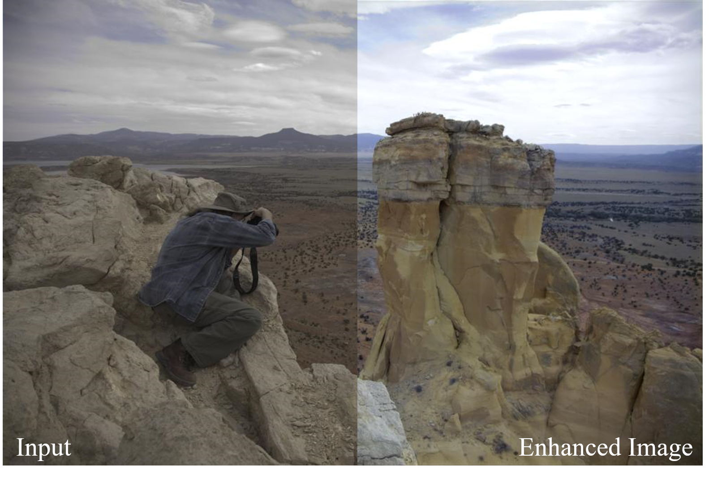

# Pytorch Implementation of Deep Photo Enhancement




### Enhancement result of images in MIT-Adboe Fivek dataset. The result show that the proposed deep learnining algorithm.

### Dependencies
* [Python 3.6](https://www.continuum.io/downloads)
* [PyTorch 1.1.0](http://pytorch.org/)

### Usage

### 1. Download MIT-Adobe Fivek dataset
They collected 5,000 photographs taken with SLR cameras by a set of different photographers. They are all in RAW format
Prepare dataset follow as this [Link](https://github.com/yuanming-hu/exposure/wiki/Preparing-data-for-the-MIT-Adobe-FiveK-Dataset-with-Lightroom)

### 2. Evaluate pretrained model
```bash
$ python val.py --checkpoint-path checkpoint_path/model_file_name
```

### 3. Train your own model
```bash
$ python train.py --model 'unet|resnet|simple'
```

### Evaluation results (TODO)


### Reference

DSLR-Quality Photos on Mobile Devices with Deep Convolutional Networks[Paper Link](http://www.vision.ee.ethz.ch/~timofter/publications/Ignatov-ICCV-2017.pdf)

Deep Photo Enhancer: Unpaired Learning for Image Enhancement from Photographs with GANs[Paper Link](https://www.cmlab.csie.ntu.edu.tw/project/Deep-Photo-Enhancer/CVPR-2018-DPE.pdf)

Learning Photographic Global Tonal Adjustment with a Database of Input / Output Image Pairs[Link](https://data.csail.mit.edu/graphics/fivek/)
